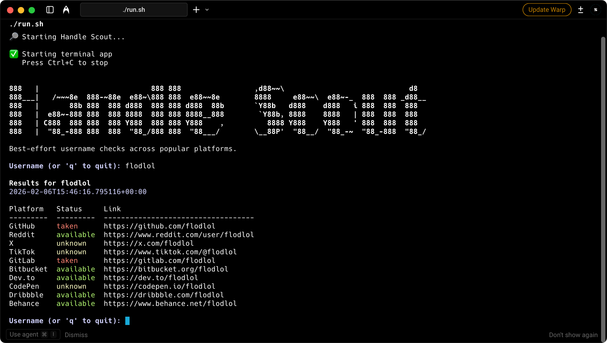

# Username Availability Checker

Check if a username is available across multiple platforms from the terminal.

---

## Preview



---

## Requirements

- Python 3.8+

---

## Installation

### Windows

1. Install [Python](https://www.python.org/downloads/) (check "Add to PATH" during installation)

2. Install required libraries:
   ```
   pip install -r requirements.txt
   ```

### Mac

1. Install Python:
   ```
   brew install python3
   ```

2. Install required libraries:
   ```
   pip3 install -r requirements.txt
   ```

---

## Running the App

### Windows
Double-click `run.bat` or run:
```
python cli.py
```

### Mac
Double-click `run.sh` or run:
```
python3 cli.py
```

You will be prompted in the terminal. Type a username and press Enter.
Type `q` to quit.

---

## Supported Platforms

- GitHub
- Reddit
- GitLab
- Bitbucket
- Dev.to
- CodePen
- Dribbble
- Behance
- X (Twitter) - manual check needed
- TikTok - manual check needed

---

## Adding a New Platform

Edit `platforms.py` and add a new line:

```python
{"name": "Instagram", "url": "https://instagram.com/{username}"},
```

For sites that require JavaScript (can't be checked automatically), add:

```python
{"name": "Snapchat", "url": "https://snapchat.com/add/{username}", "unreliable": True},
```

---

## Notes

- Checks are best-effort and lightweight.
- Some platforms use heavy JavaScript and return `unknown`.

---

## Contributing

Pull requests are welcome. Please:

- Keep checks best-effort and lightweight
- Avoid API keys or heavy scraping
- Add clear reasons for `unknown` results
